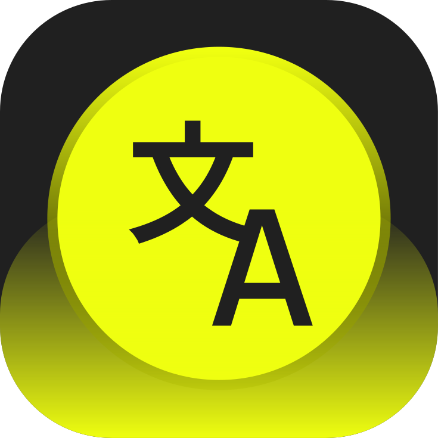

<p align="center">
  
</p>

<h1 align="center">Translingua</h1>

<p align="center">
  Static translations for templates and plugins, plus AI translation of real content — for Craft CMS 5.
</p>

<p align="center">
  <a href="#requirements">Requirements</a> ·
  <a href="#installation">Installation</a> ·
  <a href="#editions">Editions</a> ·
  <a href="#configuration">Configuration</a> ·
  <a href="#console-commands">Console commands</a> ·
  <a href="#how-it-works">How it works</a>
</p>

---

Craft gives you multi-site content but leaves you to translate it. Translingua
covers both halves of that job: the static strings baked into your templates and
your plugins, and the actual content sitting in entries, categories, globals and
Formie forms.

Nothing inside `vendor/` is ever modified, and no content is saved without you
pressing Save.

## Requirements

| | |
|---|---|
| Craft CMS | 5.0 or later |
| PHP | 8.2 or later |
| Optional | [Formie](https://verbb.io/craft-plugins/formie) 3.x for the Formie integration |
| Plus only | A DeepL, OpenAI, Anthropic or Google Gemini API key |

## Installation

From your project root:

```bash
composer require studionoir/translingua
```

```bash
php craft plugin/install translingua
```

Or install it from the Plugin Store in the control panel.

## Editions

**Lite** is free and covers static translations. **Plus** adds everything AI.

Plus is normally activated through the Plugin Store. On a local or path-repository
install you can switch editions from the command line:

```bash
php craft translingua/license/set-edition plus
```

---

## Lite

### Template translations

Translingua scans your templates, modules and local plugins for `|t`,
`Craft::t()` and `Craft.t()` calls and lists every string it finds, grouped by
translation category, so you can translate them per site language.

The scan is cached against the modification times of the files it read, so an
unchanged project never pays for a rescan. A **Rescan templates** button forces
one when you want it.

### Plugin translations

Every enabled plugin that ships language files appears automatically — CKEditor,
Formie, Knock Knock, Embedded Assets, Craft's own control panel strings, whatever
you have installed. A plugin shows up only once it is actually installed, and
disappears again if you remove it.

Strings a plugin already translates are shown pre-filled and marked **default**.
Edit one and it becomes a project override; leave it and nothing is written.

### Where translations are stored

Everything is written to:

```
translations/{locale}/{category}.php
```

Craft registers each plugin's message source with overrides enabled, so those
files transparently win over the plugin's own. Your translations are plain PHP
files in your own repository — they survive `composer update`, they diff cleanly,
and they deploy like any other code.

### Working with large sets

Formie alone ships thousands of strings, so the editor gives you search, a
missing / translated filter, and pagination. Strings with meaningful leading or
trailing whitespace are outlined so you can see them.

You can also add strings that don't exist yet, for copy you're about to write.

---

## Plus

### AI providers

DeepL, OpenAI, Anthropic (Claude) or Google Gemini, with your own key. Keys
support environment variables, so nothing secret needs to be committed:

```
$TRANSLINGUA_KEY
```

The buttons only appear once a real request to the provider has succeeded — a key
that is wrong, expired or out of quota simply means no buttons, rather than
failures at the moment you try to use them.

Identical strings are cached for a month, so re-running a batch costs nothing for
anything already translated.

### A translate button on every field

Every text input in the control panel gets one: plain text, textareas, CKEditor,
and anything any other plugin renders — the buttons work by reading the DOM, not
by knowing about specific field types, which is why they turn up inside Formie
and SEOmatic without either plugin being involved.

**No languages to pick.** The target is always the site you are editing, taken
from the site switcher. The source is detected by the provider from the text
itself. Each button states the direction it will run in — `AUTO → EN`, or
`NL → EN` if you override the source from the button's menu.

Nothing is saved for you: the translation lands in the input and you press Save.

Some things are never sent to the provider, whatever the field is called: URLs,
paths, email addresses, phone numbers, bare numbers, and Craft's own revision
notes. Link fields are a special case — only the **Label** is copy, and a link
pointing at an email address or phone number is left alone entirely, since that
label is nearly always the address itself.

### A "Translate page" button

Sits next to Save and runs over every field on the page at once.

It appears only where the page *is* content — entry, category and global set edit
screens, plus SEOmatic's Global SEO and Content SEO. On a settings screen
"translate everything" would rewrite configuration, so it is not offered there.

### Switching Translingua off per source

Sections, category groups and global sets each carry a **Translingua** toggle
on their own settings screen, beside Craft's other switches. Turn it off and that
source is left alone entirely: no translate buttons on its entries, no page
button, and it stops appearing as a choice in AI translations.

The toggle is a Pro control, so it only appears on Pro installs — on Lite there
would be nothing for it to switch.

### Batch translations

Translate entries, categories and global sets from one site into any number of
others, on the queue. Pick exactly which fields to run over, including fields
nested inside Matrix blocks.

Fields whose translation method is `none` are shown but disabled: Craft stores one
value for every site, so "translating" one would overwrite the source. Set the
field to translate per site first.

Optionally creates a revision before each element is written, so a batch run can
be rolled back from the element's revision menu.

### The Formie tab

Formie's form builder gets a Translingua tab, where you can:

- **Set the language the form is written in.** A Formie form isn't stored per site
  the way an entry is, so the current site is a poor guess at what a translation
  should produce. This setting is the answer: it becomes the target language for
  the form and drives the translate buttons throughout the builder. Left alone, it
  falls back to the language of the site the form belongs to.
- **Translate the whole form**, server-side rather than through the DOM — so it
  reaches every field, including ones whose settings panel you have never opened.
  The tab lists exactly which strings will be sent before you run it.

Translating rewrites the form in place, because that is where Formie keeps its
labels. Duplicate the form first if you want to keep the original.

| Translated | Never touched |
|---|---|
| Field label, placeholder, instructions, error message, default value | Field handles |
| Behaviour tab: submission message, error message | Option values |
| | CSS classes, input attributes |

Handles are the key used by submissions, notifications, integrations and your
templates, so they are structurally excluded — not filtered out by name, but never
collected in the first place.

---

## Configuration

Settings live at **Translingua → Settings**, or in `config/translingua.php`
for anything you would rather keep in code:

```php
<?php

return [
    'provider' => 'deepl',
    'apiKey' => '$TRANSLINGUA_KEY',
    'promptContext' => 'Address the reader informally. Leave product names in English.',
    'batchSize' => 25,
    'createRevisions' => true,
];
```

| Setting | Default | What it does |
|---|---|---|
| `provider` | `deepl` | `deepl`, `openai`, `anthropic` or `google` |
| `apiKey` | — | Supports `$ENV_VAR` |
| `model` | per provider | Only used by the LLM providers |
| `promptContext` | — | Tone of voice, terms to leave alone, formality |
| `enableFieldButtons` | `true` | Per-field translate buttons |
| `enablePageButton` | `true` | The "Translate page" button |
| `pageButtonPaths` | see settings | Screens the page button may appear on |
| `fieldButtonExcludedPaths` | see settings | Screens that get no buttons at all |
| `excludedFieldPatterns` | `handle`, `slug`, … | Input names never offered for translation |
| `batchSize` | `25` | Strings per provider request |
| `createRevisions` | `true` | Revision before each batch write |
| `extraScanPaths` | — | Extra directories to scan for strings |

### Permissions

Two permissions are registered: **Manage static translations** and **Use AI
translations**. Plugin settings remain admin-only.

## Console commands

```bash
php craft translingua/translate/sources
```

```bash
php craft translingua/translate/scan
```

```bash
php craft translingua/translate/elements --from=siteHandle --to=otherSite --groups="Blog,News"
```

Add `--inline` to run immediately instead of queueing, and `--overwrite` to
replace target content that already exists.

## How it works

**Static translations** are plain PHP files in `translations/`. Craft's own
override mechanism does the rest — the plugin adds an editor, not a runtime.

**Field buttons** read and write the DOM and nothing else. They never save; that
stays your decision, and it is why they work inside plugins the plugin has no
knowledge of.

**Batch translations** pair the source and target versions of an element by field
path — including block index and entry type inside Matrix — rather than by
position, and refuse to write any value Craft considers shared between sites.

### Known limitations

- The per-field buttons translate what is **in the field**. If the target site's
  field is empty there is nothing to work from — use a batch run, which reads the
  source site from the database.
- Formie forms are rewritten in place; they are not localised per site.
- Machine translation is a first draft. Have a speaker read it.

## Licence

Proprietary. The Lite edition may be used free of charge; Pro requires a paid
licence per Craft install. See [LICENSE.md](LICENSE.md).

## Support

- Issues: [GitHub issues](https://github.com/studionoirbe/translingua/issues)
- Email: [info@studionoir.be](mailto:info@studionoir.be)
- Changelog: [CHANGELOG.md](CHANGELOG.md)

<p align="center">Made by <a href="https://studionoir.be">Studio Noir</a></p>
